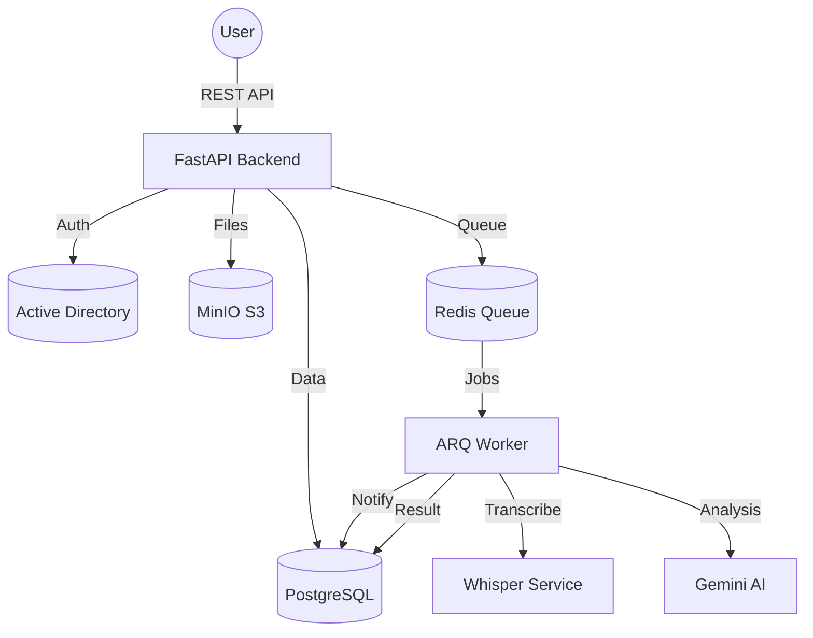

# 🎤 PM Assistant

> **Transforming meetings into actionable intelligence.**  
> An enterprise-grade AI system for automated transcription, summarization, and project management integration.

[](https://fastapi.tiangolo.com)
[](https://www.postgresql.org)
[](https://redis.io)
[](https://www.docker.com)

---

## 🌟 Overview

**PM Assistant** is a high-performance backend system designed to bridge the gap between spoken meetings and structured project execution. It automates the tedious parts of a Project Manager's workflow: listening, note-taking, and task extraction.

By leveraging **Whisper** for high-accuracy transcription and **Google Gemini** for intelligent analysis, it turns hours of audio into concise summaries and clear Action Items.

---

## 🚀 Key Features

- 🎧 **High-Fidelity Transcription**: Integrated with Whisper (Local or API) for multilingual speech-to-text.
- 🧠 **AI Synthesis**: Leverages Gemini 1.5 Pro/Flash to generate structured summaries and key takeaways.
- ✅ **Automated Action Items**: Intelligently extracts tasks, deadlines, and owners from meeting transcripts.
- 🏢 **Enterprise Ready**: Full Active Directory (LDAP) integration for secure, centralized authentication.
- 🏗️ **Project Centric**: Organize meetings into projects with granular Role-Based Access Control (RBAC).
- 🔔 **Smart Notifications**: Real-time updates on processing progress and system alerts.
- ☁️ **S3 Compatible Storage**: Securely stores audio assets in MinIO or any S3-compatible provider.

---

## 🏗️ Architecture

The system is built on a modern, asynchronous foundation to handle heavy AI workloads without blocking the user interface.



---

## 🛠️ Technology Stack

| Component | Technology |
| :--- | :--- |
| **Language** | Python 3.12+ |
| **Framework** | [FastAPI](https://fastapi.tiangolo.com/) |
| **Database** | [PostgreSQL 17](https://www.postgresql.org/) (with pgvector) |
| **Task Queue** | [Redis](https://redis.io/) + [ARQ](https://github.com/samuelcolvin/arq) |
| **Auth** | LDAP / Active Directory |
| **AI (STT)** | OpenAI Whisper (Local Server) |
| **AI (LLM)** | Google Gemini 1.5 Pro |
| **Storage** | MinIO / AWS S3 |

---

## ⚡ Quick Start

### Prerequisites

- [uv](https://github.com/astral-sh/uv) (Modern Python package manager)
- Docker & Docker Compose
- Access to a Whisper server and Gemini API Key

### Installation

1. **Clone the repository:**
   ```bash
   git clone <repository-url>
   cd pm-assistant
   ```

2. **Environment Setup:**
   ```bash
   cp .env.example .env
   # Edit .env with your credentials (S3, Gemini, LDAP)
   ```

3. **Deploy with Docker (Recommended):**
   ```bash
   make up
   # This runs: docker-compose up -d --build
   ```

4. **Initialize Database:**
   ```bash
   make migrate
   ```

### Local Development

If you prefer running without Docker for development:

```bash
# Install dependencies
uv sync

# Run API
uv run uvicorn src.main:app --reload

# Run Worker
uv run arq src.core.tasks.WorkerSettings
```

---

## 📖 API Documentation

Once the server is running, explore the interactive documentation:

- **Swagger UI**: [http://localhost:8000/docs](http://localhost:8000/docs)
- **ReDoc**: [http://localhost:8000/redoc](http://localhost:8000/redoc)
- **Health Check**: [http://localhost:8000/health](http://localhost:8000/health)

---

## 🔒 Security & Privacy

- **RBAC**: Three distinct roles (PM, Manager, Member) ensure users only see what they are authorized to access.
- **LDAP Auth**: No passwords stored locally; all authentication is offloaded to your corporate Active Directory.
- **S3 Presigned URLs**: Audio files are never public. Access is granted via time-limited, secure tokens.
- **Data Isolation**: Meetings are strictly bound to projects, preventing cross-project data leakage.

---

## 🛤️ Roadmap

- [ ] **Frontend**: Modern React-based dashboard (Coming Soon).
- [ ] **Jira/Confluence**: Direct export of Action Items to Jira tickets.
- [ ] **Interactive Chat**: Ask questions about your meeting transcripts using RAG.
- [ ] **Export**: PDF/Markdown export for meeting minutes.

---

## 🤝 Contributing

Contributions are welcome! Please see our [Contributing Guide](CONTRIBUTING.md) for details.

1. Fork the Project
2. Create your Feature Branch (`git checkout -b feature/AmazingFeature`)
3. Commit your Changes (`git commit -m 'Add some AmazingFeature'`)
4. Push to the Branch (`git push origin feature/AmazingFeature`)
5. Open a Pull Request

---

## 📄 License

Distributed under the MIT License. See `LICENSE` for more information.

---

**Developed with ❤️ by ОсОО MDigital**
