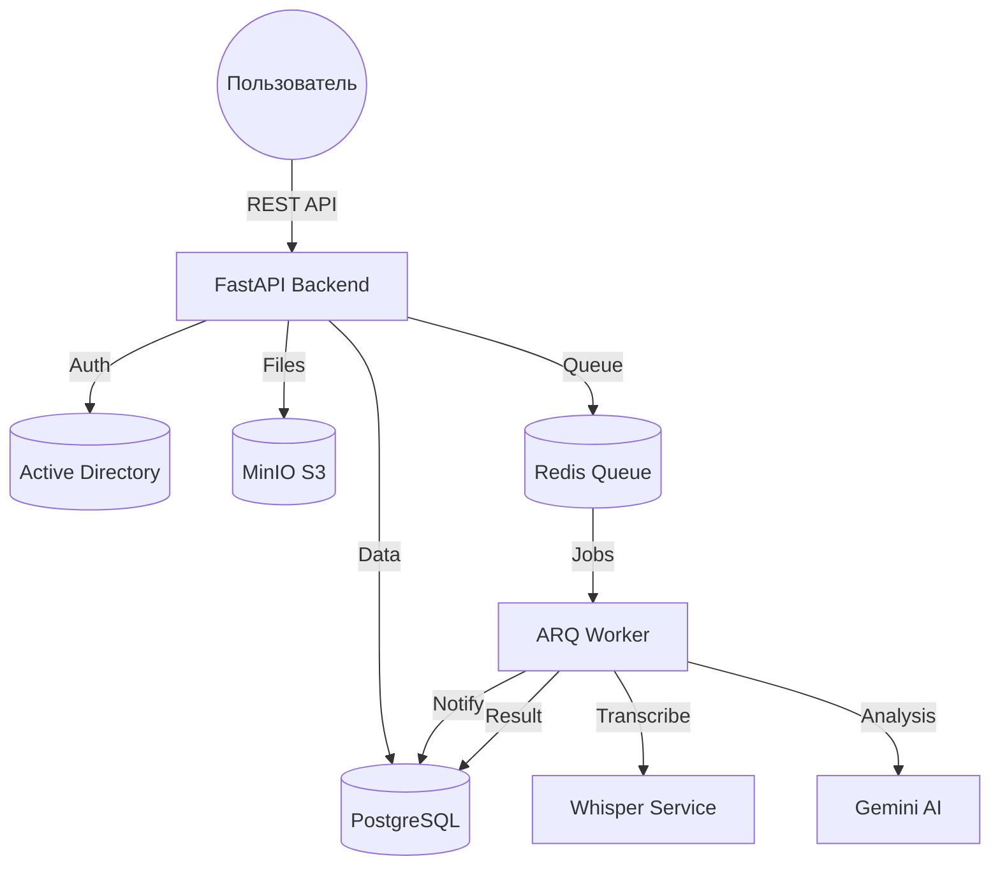

# 🎤 PM Assistant — Ваш интеллектуальный помощник

> **Превращайте встречи в конкретные результаты.**  
> Система корпоративного уровня на базе ИИ для автоматической транскрибации, умного суммаризации и управления проектами.

[](https://fastapi.tiangolo.com)
[](https://www.postgresql.org)
[](https://redis.io)
[](https://www.docker.com)

---

## 🌟 Обзор системы

**PM Assistant** — это мощный бэкенд, разработанный для автоматизации рутинных задач проект-менеджеров. Система берет на себя самую скучную часть работы: прослушивание записей, ведение заметок и вычленение задач из разговоров.

Используя мощный движок **Whisper** для транскрибации и **Google Gemini** для глубокого анализа, PM Assistant превращает часы аудиозаписей в лаконичные резюме и четкие списки Action Items.

---

## 🚀 Основные возможности

- 🎧 **Точная транскрибация**: Интеграция с Whisper (локальный сервер или API) для высокого качества распознавания речи.
- 🧠 **AI-синтез**: Использование Gemini 1.5 Pro/Flash для создания структурированных резюме и ключевых выводов.
- ✅ **Автоматические задачи**: Интеллектуальное извлечение поручений, дедлайнов и ответственных прямо из контекста разговора.
- 🏢 **Корпоративная безопасность**: Полная интеграция с Active Directory (LDAP) для единой точки входа (SSO).
- 🏗️ **Проектное управление**: Организация встреч по проектам с гибким ролевым доступом (RBAC).
- 🔔 **Умные уведомления**: Оповещения о статусе обработки в реальном времени.
- ☁️ **S3 Хранилище**: Надежное хранение аудиофайлов в MinIO (или любом S3-совместимом облаке).

---

## 🏗️ Архитектура

Система построена на современной асинхронной архитектуре, способной обрабатывать тяжелые задачи без блокировки работы пользователей.



---

## 🛠️ Технологический стек

| Компонент | Технология |
| :--- | :--- |
| **Язык** | Python 3.12+ |
| **Фреймворк** | [FastAPI](https://fastapi.tiangolo.com/) |
| **База данных** | [PostgreSQL 17](https://www.postgresql.org/) (с pgvector) |
| **Очередь задач** | [Redis](https://redis.io/) + [ARQ](https://github.com/samuelcolvin/arq) |
| **Авторизация** | LDAP / Active Directory |
| **ИИ (STT)** | OpenAI Whisper (Local Server) |
| **ИИ (LLM)** | Google Gemini 1.5 Pro |
| **Хранилище** | MinIO / AWS S3 |

---

## ⚡ Быстрый старт

### Предварительные условия

- [uv](https://github.com/astral-sh/uv) (современный менеджер пакетов Python)
- Docker и Docker Compose
- Доступ к Whisper-серверу и API-ключ Gemini

### Установка

1. **Клонируйте репозиторий:**
   ```bash
   git clone <repository-url>
   cd pm-assistant
   ```

2. **Настройка окружения:**
   ```bash
   cp .env.example .env
   # Отредактируйте .env: укажите S3, Gemini, LDAP
   ```

3. **Запуск через Docker:**
   ```bash
   make up
   # Эквивалент: docker-compose up -d --build
   ```

4. **Применение миграций:**
   ```bash
   make migrate
   ```

### Локальная разработка

Если вы хотите запустить систему без Docker:

```bash
# Установка зависимостей
uv sync

# Запуск API
uv run uvicorn src.main:app --reload

# Запуск Worker
uv run arq src.core.tasks.WorkerSettings
```

---

## 📖 Документация API

После запуска сервера документация доступна по адресам:

- **Swagger UI**: [http://localhost:8000/docs](http://localhost:8000/docs)
- **ReDoc**: [http://localhost:8000/redoc](http://localhost:8000/redoc)
- **Health Check**: [http://localhost:8000/health](http://localhost:8000/health)

---

## 🔒 Безопасность и Приватность

- **RBAC**: Три роли (PM, Manager, Member) разграничивают доступ к чувствительным данным проектов.
- **LDAP**: Пароли не хранятся в системе; авторизация делегирована вашему Active Directory.
- **S3 Presigned URLs**: Аудиофайлы не доступны публично. Доступ через временные подписанные токены.
- **Изоляция данных**: Каждая встреча жестко привязана к проекту.

---